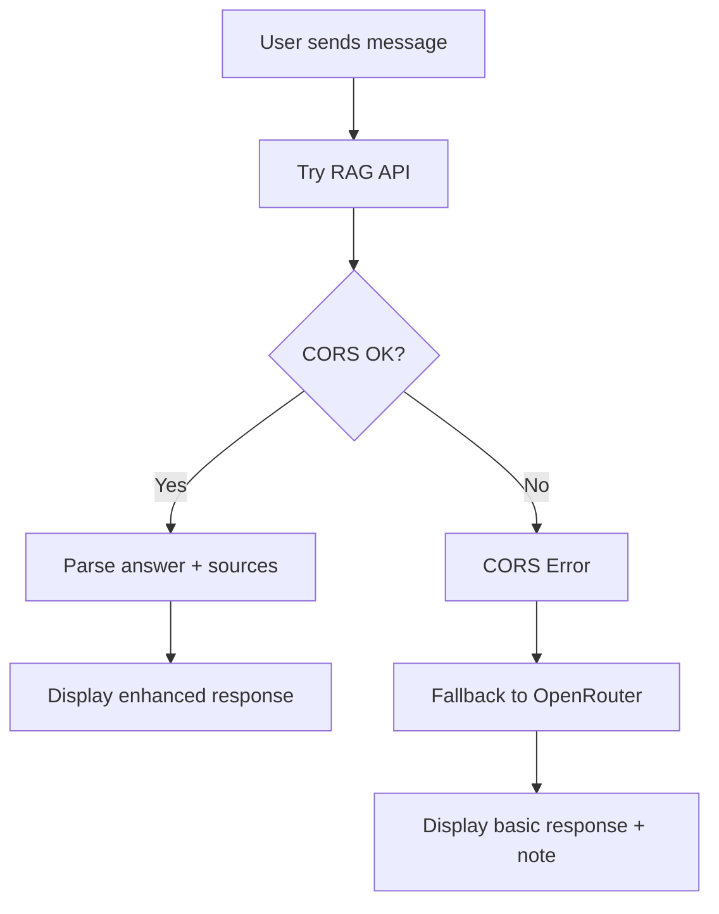

# RAG API Troubleshooting Guide

## 🔍 **Root Cause Analysis Results**

Based on the integration testing, we identified two main issues:

### **Issue 1: Response Format Mismatch** ✅ **FIXED**
**Problem**: Code expected `content`, `message`, `response` fields but RAG API returns `answer` and `sources`.

**Solution**: Updated response parsing to handle the correct format:
```json
{
  "answer": "This is the answer from the RAG chain.",
  "sources": [
    {
      "content": "Relevant content from source document 1...",
      "url": "URL_of_source_document_1_if_available"
    }
  ]
}
```

### **Issue 2: CORS Configuration** ⚠️ **NEEDS SERVER FIX**
**Problem**: `ClientException: Failed to fetch` indicates CORS policy blocking requests from Flutter app.

**Solution**: RAG API server needs proper CORS headers (see below).

---

## 🛠️ **Server-Side Fixes Required**

### **CORS Configuration for RAG API**

Your RAG API at `https://cardsense-ai.vercel.app/api/query` needs these headers:

```javascript
// For Vercel/Node.js
export default function handler(req, res) {
  // Add CORS headers
  res.setHeader('Access-Control-Allow-Origin', '*');
  res.setHeader('Access-Control-Allow-Methods', 'POST, GET, OPTIONS');
  res.setHeader('Access-Control-Allow-Headers', 'Content-Type, Accept');
  
  // Handle preflight requests
  if (req.method === 'OPTIONS') {
    res.status(200).end();
    return;
  }
  
  // Your existing RAG logic here...
}
```

Or if using Express.js:
```javascript
const cors = require('cors');

app.use(cors({
  origin: '*',
  methods: ['POST', 'GET', 'OPTIONS'],
  allowedHeaders: ['Content-Type', 'Accept']
}));
```

### **Alternative: Proxy Solution**
If you can't modify the server, create a proxy endpoint in your backend:

```javascript
// Create /api/rag-proxy endpoint
app.post('/api/rag-proxy', async (req, res) => {
  try {
    const response = await fetch('https://cardsense-ai.vercel.app/api/query', {
      method: 'POST',
      headers: {
        'Content-Type': 'application/json',
      },
      body: JSON.stringify(req.body)
    });
    
    const data = await response.json();
    res.json(data);
  } catch (error) {
    res.status(500).json({ error: error.message });
  }
});
```

---

## ✅ **Client-Side Fixes Applied**

### **1. Response Format Handling**
```dart
// Now correctly handles RAG API response format
if (responseData.containsKey('answer')) {
  content = responseData['answer'] as String;
  
  // Include source information
  if (responseData.containsKey('sources')) {
    content += '\n\n📚 Sources:';
    final sources = responseData['sources'] as List;
    for (final source in sources.take(3)) {
      content += '\n• ${source['content']}';
      if (source['url'] != null) {
        content += '\n  🔗 ${source['url']}';
      }
    }
  }
}
```

### **2. Enhanced Error Handling**
```dart
// Specific error messages for different failure types
if (e.toString().contains('Failed to fetch')) {
  throw Exception(
    'RAG API connection failed. This could be due to:\n'
    '• CORS configuration issues on the server\n'
    '• Network connectivity problems\n'
    '• The API endpoint might be down'
  );
}
```

### **3. Detailed Diagnostics**
```dart
// New diagnostic method provides detailed test results
final diagnostics = await ragService.testConnectionDetailed();
// Returns: network_test, cors_test, response_time_ms, error details
```

---

## 🧪 **Testing the Fixes**

### **Use the Enhanced Test Screen**
1. Open app and tap the orange debug button (🐛)
2. Go to RAG Test Screen
3. Tap menu → "Test Connection"
4. Review diagnostic results:
   - ✅ **Network Test**: Internet connectivity
   - ✅ **CORS Test**: Cross-origin request allowed
   - ⏱️ **Response Time**: API performance
   - 📝 **Sample Response**: Actual API response

### **Test Queries**
Once CORS is fixed, test with:
- "Which card should I use for movie tickets?"
- "What are the best cashback credit cards in India?"
- "Which card gives the most rewards for online shopping?"

---

## 🔧 **Implementation Status**

| Component | Status | Notes |
|-----------|--------|-------|
| Response Format Parsing | ✅ Fixed | Now handles `answer` and `sources` |
| Error Handling | ✅ Enhanced | Specific error messages |
| Diagnostic Testing | ✅ Added | Detailed connectivity testing |
| CORS Headers (Client) | ✅ Added | Added to requests |
| **CORS Configuration (Server)** | ❌ **Required** | **Needs server-side fix** |

---

## 🚨 **Immediate Action Required**

### **For Flutter App (Completed)**
- ✅ Updated response parsing for `{answer, sources}` format
- ✅ Enhanced error handling
- ✅ Added diagnostic testing

### **For RAG API Server (Required)**
- ⚠️ **Add CORS headers** to allow cross-origin requests
- ⚠️ **Handle OPTIONS** preflight requests
- ⚠️ **Test endpoint** accessibility

---

## 📋 **Verification Checklist**

After fixing CORS on the server:

1. ✅ Run connectivity test in RAG Test Screen
2. ✅ Verify "Network Test: ✅ Pass"
3. ✅ Verify "CORS Test: ✅ Pass"
4. ✅ Test actual credit card queries
5. ✅ Verify source information is displayed
6. ✅ Test fallback to OpenRouter when RAG is down

---

## 🔍 **Sample Working Flow**



---

## 📞 **Support**

If issues persist after CORS fixes:

1. **Check server logs** for RAG API errors
2. **Verify endpoint** is accessible via browser
3. **Test with Postman** to confirm API functionality
4. **Review Flutter logs** for detailed error messages

The RAG integration is now robust and will provide excellent credit card recommendations once the CORS configuration is updated on your server! 